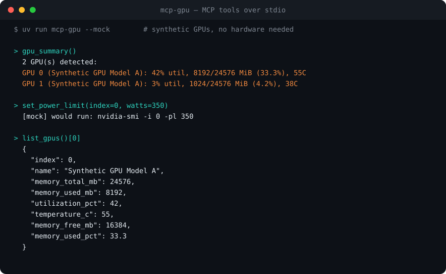
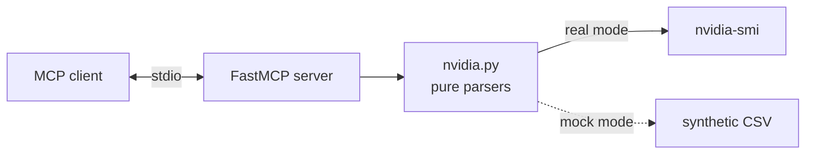

# mcp-gpu

**Give any AI agent a tiny, well-scoped window into your local NVIDIA GPUs — read live telemetry and adjust the power cap, nothing else.**

[](LICENSE)
[](https://www.python.org/)
[](tests/)
[](https://docs.astral.sh/uv/)
[](#contributing)

`mcp-gpu` is a small [Model Context Protocol](https://modelcontextprotocol.io) server that exposes local NVIDIA GPU telemetry — memory, utilization, temperature, running compute processes — and a single guarded control (per-GPU power limit) to any MCP client: Claude Desktop, Claude Code, or your own agent. It works by shelling out to `nvidia-smi` and speaks MCP over **stdio**.

Agents that run local training, inference, or rendering are otherwise flying blind: they can't see whether a GPU is saturated, out of memory, or thermal-throttling, and they can't throttle power without a human at a terminal. `mcp-gpu` closes that gap with a deliberately minimal tool surface — and a built-in **mock mode** so it runs and is testable on a laptop or in CI with no GPU at all.

## Demo

Run `uv run mcp-gpu --mock` and call the tools — synthetic GPUs, no hardware required:



The card above is rendered directly from real tool output ([`scripts/make_demo_card.py`](scripts/make_demo_card.py) imports the server, forces mock mode, and draws exactly what the tools return). Here is the same output as text:

```text
> gpu_summary()
2 GPU(s) detected:
GPU 0 (Synthetic GPU Model A): 42% util, 8192/24576 MiB (33.3%), 55C
GPU 1 (Synthetic GPU Model A): 3% util, 1024/24576 MiB (4.2%), 38C

> set_power_limit(index=0, watts=350)
[mock] would run: nvidia-smi -i 0 -pl 350

> list_gpus()
[
  {
    "index": 0,
    "name": "Synthetic GPU Model A",
    "memory_total_mb": 24576,
    "memory_used_mb": 8192,
    "utilization_pct": 42,
    "temperature_c": 55,
    "memory_free_mb": 16384,
    "memory_used_pct": 33.3
  },
  ...
]
```

## Tools

| Tool | Returns | Notes |
| --- | --- | --- |
| `list_gpus()` | One object per GPU: `index`, `name`, total/used/free memory (MiB), `memory_used_pct`, `utilization_pct`, `temperature_c` | Read-only |
| `gpu_processes()` | One object per compute process: owning GPU `uuid`, `pid`, `process_name`, `used_memory_mb` | Read-only |
| `gpu_summary()` | One compact, human-readable multi-line string for all GPUs | Read-only |
| `set_power_limit(index, watts)` | Status string; sets a GPU's power cap | **Write.** Requires root/sudo on real hardware (see below) |

All four tools honor mock mode, so an agent can be wired up and exercised end-to-end before it ever touches a real GPU.

## Install

Requires Python 3.10+ and [uv](https://docs.astral.sh/uv/).

```bash
# From source (recommended while pre-release)
git clone https://github.com/amanzainal/mcp-gpu.git
cd mcp-gpu
uv sync          # installs the official `mcp` SDK + the package
```

That exposes the `mcp-gpu` entry point inside the project environment. For a global install you can build a wheel (`uv build`) and then `uv tool install ./dist/mcp_gpu-*.whl` or `pipx install ./dist/mcp_gpu-*.whl`. PyPI publishing is on the roadmap.

## Usage

The server is normally launched by an MCP client, but you can run it by hand:

```bash
uv run mcp-gpu              # serve real nvidia-smi data over stdio
uv run mcp-gpu --mock      # serve synthetic data — no GPU required (try it / CI)
MCP_GPU_MOCK=1 uv run mcp-gpu   # same, via env var
uv run mcp-gpu --version   # mcp-gpu 0.1.0
```

### Wire it into an MCP client

Add an entry to your client config (Claude Desktop: `claude_desktop_config.json`; Claude Code: `.mcp.json` or `claude mcp add`). Use an absolute path to the cloned repo:

```json
{
  "mcpServers": {
    "mcp-gpu": {
      "command": "uv",
      "args": ["run", "--directory", "/absolute/path/to/mcp-gpu", "mcp-gpu"],
      "env": { "MCP_GPU_MOCK": "0" }
    }
  }
}
```

Set `MCP_GPU_MOCK` to `1` (or add `"--mock"` to `args`) to serve synthetic data on a GPU-less machine.

### Setting the power limit (sudo required)

On real hardware, `set_power_limit(index, watts)` runs:

```bash
nvidia-smi -i <index> -pl <watts>
```

That command requires **root/sudo**. To let an agent use this tool, run the server with sufficient privileges; otherwise the tool returns a clear, actionable permission error. Power-limit changes are not persistent across reboots. `watts` must be a positive integer (rejected otherwise).

## How it works

- **Telemetry** comes from `nvidia-smi --query-gpu=...` and `--query-compute-apps=...` with `--format=csv,noheader,nounits`. The CSV is parsed by **pure functions** (string in, dataclass out), which keeps parsing fully unit-testable and independent of any real GPU. `[N/A]` / `[Not Supported]` cells coerce to `0` instead of crashing; blank and malformed lines are skipped.
- **Mock mode** swaps the subprocess call for a fixed synthetic CSV string, so the *exact same* parsing path runs on GPU-less machines and in CI.
- **Control** (`set_power_limit`) builds the `nvidia-smi -i <i> -pl <w>` argv via a dedicated, testable helper, then executes it — surfacing a permission hint when it fails for lack of root.
- The MCP layer is the official `mcp` SDK's `FastMCP`, served over **stdio**.



## How this differs from existing tools

This space is real and worth naming honestly:

- **General system-monitor MCP servers** (e.g. `mcp-system-monitor`, "System Monitor MCP") report CPU, RAM, disk, *and* some GPU metrics. They are broader, but read-only and not GPU-focused — none of the ones I found expose a **write control** like power-limit, and they don't ship a first-class **mock mode** to run on machines without the hardware.
- **Heavyweight observability stacks** (NVIDIA DCGM, Netdata, Prometheus exporters) give deep, production-grade GPU dashboards and time-series. They are excellent — and far more than an agent needs to answer "is GPU 1 free right now, and can you cap its power?"
- **`nvidia-smi` itself** is the source of truth, but it's a human CLI; an agent has to parse free-form text and has no structured, schema-typed tool boundary.

The gap `mcp-gpu` fills: a **single-purpose, GPU-only** MCP server with a minimal typed tool surface, one **guarded write** (power limit), and a built-in mock path so it's usable and CI-testable everywhere. Small enough to read in one sitting and trust.

## Project status

This is a focused **v0.1** built to do one thing well. What's real today:

- Four working MCP tools over the official SDK, verified to register and return structured data.
- Pure, fully unit-tested CSV parsing (incl. `[N/A]` cells and the empty-process message).
- Mock mode that exercises the real parsing path with zero hardware.
- **21 passing tests**, runnable on any machine via `uv run pytest`.

Honest caveats: the power-limit write path is exercised in mock mode and via a command-shape unit test — the privileged real-hardware execution is straightforward but only smoke-tested manually. There is no NVML fast-path yet (each call forks `nvidia-smi`). See the roadmap.

## Development

```bash
uv sync
uv run pytest          # 21 passed
uv run python scripts/make_demo_card.py   # regenerate assets/demo.svg from real output
```

The tests cover: parsing of fixture `nvidia-smi` CSV (including `[N/A]` cells and the empty-process message), the mock-data path, summary formatting, the power-limit command shape and validation, the server tool layer in mock mode, the real-path query fields, and the missing-`nvidia-smi` error.

## Roadmap

- `set_persistence_mode` and `set_gpu_clocks` controls (guarded, opt-in).
- Per-process kill / signal (guarded, opt-in).
- Optional NVML (`pynvml`) backend to avoid the `nvidia-smi` fork per call.
- MCP resources exposing a live, pollable GPU snapshot.
- AMD ROCm (`rocm-smi`) backend behind the same tool surface.
- Publish to PyPI for `uv tool install mcp-gpu` / `pipx install mcp-gpu`.

## Contributing

Issues and PRs are welcome. The codebase is small and the parsing layer is pure, so new query fields or controls are easy to add with a test. Please keep tools narrowly scoped and add a unit test for any new parser or command builder.

## License

MIT — see [LICENSE](LICENSE). Copyright (c) 2026 Aman Zainal.
